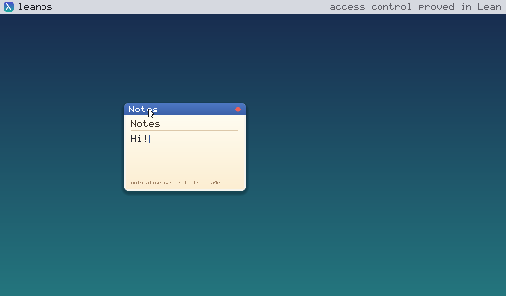
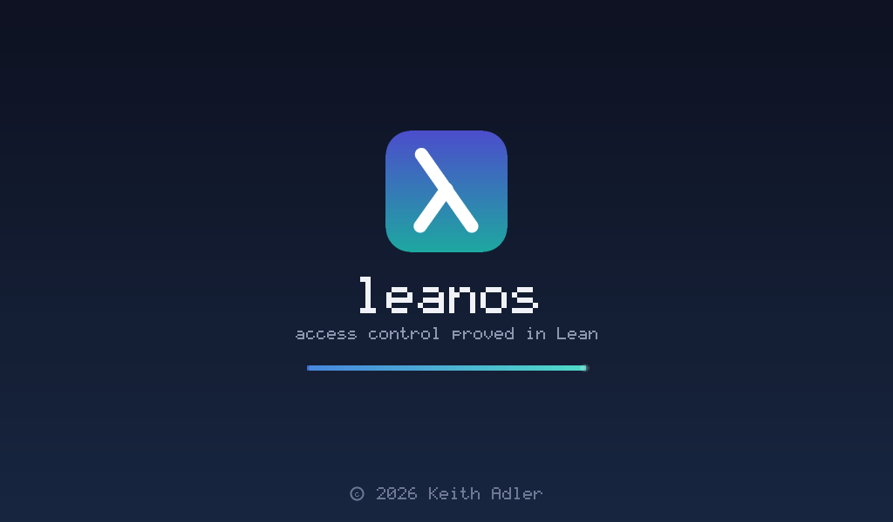

# leanos

[](https://keithadler.github.io/leanviz/?p=leanos)

**An operating system for the Raspberry Pi 4 whose kernel decisions are written in Lean 4
and proved correct.**

Who may touch which memory, which device, which file, which task runs next: every one of
those decisions is Lean code, compiled into the kernel image. The theorems are about that
same code, not about a separate specification that could drift from what runs. Underneath,
about 2,700 lines of C and assembly boot the board, write page tables and switch tasks,
but decide nothing.

On top of it is a small but real desktop system: windows, a dock, a file system with a
journal, USB, a network stack, a text web browser, and programs you run from the SD card.
Each of those is confined to exactly what it was given.



> **Status: a working prototype, and a start.** Everything here runs and is tested on
> QEMU's emulated Raspberry Pi 4 (`raspi4b`). The SD card image for a real Pi 4 builds and
> is checked, but it has **not yet booted on real hardware**.

## Why, and what comes next

Proved kernels exist: seL4, the best known, is written in C and proved in Isabelle/HOL, with a
refinement proof tying the two together, and it remains far more thoroughly verified than
leanos. leanos tries a different route: the kernel's decisions are written *in* Lean, the
language the proofs are in, and that same code is compiled straight into the image a
Raspberry Pi boots. The goal is a **real-world implementation** of that idea: not a model,
but a system you can boot, click around in and try to break.

This is the start. The next steps, in order:

1. **Real hardware.** Boot the image on a physical Raspberry Pi 4 and fix what the emulator
   does not model: the SD controller, the screen, timing, the USB-A ports (an xHCI driver
   over PCIe) and the Pi's own Ethernet.
2. **Newer Pis.** The Raspberry Pi 5, whose peripherals sit behind its RP1 chip, and later
   boards. The Lean kernel carries over unchanged; the machine layer and drivers are the work.
3. **Wider.** `https`, more programs, and the proofs pushed further down into the machine
   layer.

[ROADMAP.md](ROADMAP.md) has the details, and what each stage proved.

## What it does

- **A desktop** at 1024×600: windows you can drag, minimize, zoom and go through with
  Ctrl+O, a menu bar with the date and time in the time zone chosen in Settings, and a dock. Built-in apps: Notes, Files, Terminal, Settings,
  Security and Apps; the dock also keeps Clock, Calculator, Tour and Web from the SD card. What
  opens at startup is a list on the SD card (`startup.txt`: Apps and the tour, to begin with).
- **Copy and paste, by hand only**: Ctrl+C and Ctrl+V (or the Edit menu in the menu bar)
  between Notes, Terminal and `edit`. The display server keeps the clipboard. It asks the
  window in front for its text only when you press Ctrl+C, takes the answer only from that
  window, and hands the text only to the window in front when you press Ctrl+V. No program
  can read the clipboard, or put text on it, by asking.
- **Programs from the SD card**: `web` (a text web browser), `edit` (a text editor),
  `clock`, `calc`, `snake`, `life`, `tiles` (2048), `tour`, `fuzz` and `hello`. Up to six
  run at once, each confined to its own memory, a window, its own folder, the files you hand
  it, and the network only if you allow it.
- **A real file system** on the SD card: folders, large files, and a write-ahead journal so
  a power cut never leaves a change half done (proved for a model of the journal, and
  tested by cutting the power twelve times mid-write).
- **USB**: keyboards, mice and touchscreens, and a USB network adapter. The USB controller
  has no IOMMU, so the kernel checks every DMA transfer against the driver's own memory.
- **Networking**: DHCP, DNS, ping, TCP and HTTP/1.0; the time of day from an NTP server;
  `web` for plain `http://` pages.
- **All four cores** run tasks.
- **Verified boot**: every program is measured with SHA-256 and runs only if it matches
  the boot manifest. Flip one bit and it is refused.
- **The tour**: open Terminal and type `tour`. An untrusted program really tries what
  malware does on a desktop (read your files, another program's memory, the disk, your
  keystrokes, your clipboard; run code it wrote; switch the machine off). It shows the
  kernel's answer next to what a typical Linux desktop allows, and ends with what Linux does
  better.



## What is proved

77 theorems in [`LeanOS/Proofs.lean`](LeanOS/Proofs.lean), [`LeanOS/Tables.lean`](LeanOS/Tables.lean),
[`LeanOS/Bounds.lean`](LeanOS/Bounds.lean), [`LeanOS/Fair.lean`](LeanOS/Fair.lean) and [`LeanOS/Journal.lean`](LeanOS/Journal.lean), for every state the kernel can reach,
under any sequence of system calls with any arguments. Among them:

- **Authority flows only along grants.** A task holds a frame of memory only if a chain of
  grants from its owner could have given it, never with more rights. Only three servers
  (display, files, network) ever hold another task's memory, and none can pass it on.
  Every other task only ever reaches its own (`confined`).
- **No page is ever both writable and executable.**
- **No forged identity.** Endpoint badges never change, so a server always knows who is
  asking (`file_server_knows_the_sender`).
- **Only verified code runs** in the manifest's slots (`only_verified_runs`).
- **Devices stay with their owners.** Only the display server reaches the screen, only
  the file server the disk, only the USB driver the USB controller. The controller's DMA
  only ever touches the driver's own memory (`usb_dma_own_memory`).
- **The hardware is safe from software.** Only Settings changes the board's settings, and
  never overclocks the CPU (`cpu_never_overclocked`). Only the display server can switch the
  machine off. Only the USB driver can set the time.
- **The clock never goes back**, and `sleep` never ends early.
- **Scheduling**: the scheduler picks only ready tasks, and never gives a core a task
  another core is running.
- **Servers serve in turn.** Of the tasks waiting to send to a server, a receive takes the
  first after the one it took last, wrapping around (`recv_in_turn`). So while a task waits
  to send, the server takes at most 17 messages from others (`recv_bounded_wait`), and
  programs in low slots can no longer starve one in a higher slot.
- **The kernel's memory is bounded.** No system call can make the kernel's state grow past
  a fixed size: at most 64 capabilities, 8192 mappings and 8 reply slots per task, and
  447,559 heap objects in all (`stateSize_le`), at most 22.8 MiB under the runtime's layout.
- **Down to the page tables**: Lean computes every translation-table word, and against a
  model of the Armv8-A MMU, user mode reaches exactly its own mappings and nothing of the
  kernel's (`walk_eq_view`).

**Browse every proof in [LeanViz](https://keithadler.github.io/leanviz/?p=leanos)**: each
theorem's statement, what it uses, what uses it, and the axioms it rests on, re-checked by
[Tenet](https://github.com/keithadler/tenet), an independent Lean 4 kernel (66,608
declarations, 0 rejected). Start with
[`confined`](https://keithadler.github.io/leanviz/?p=leanos#/d/LeanOS.confined),
[`no_write_execute`](https://keithadler.github.io/leanviz/?p=leanos#/d/LeanOS.no_write_execute)
or [`crash_atomic`](https://keithadler.github.io/leanviz/?p=leanos#/d/LeanOS.Journal.crash_atomic).

Every theorem rests only on Lean's standard axioms (checked by `make test`), and
`make mutants` breaks the kernel in 108 specific ways and checks that the proofs reject every
one. [TRUST.md](TRUST.md) says exactly what is proved and what is trusted: the Lean
compiler, a small runtime shim, the machine layer, the MMU model, and the hardware.

## Quick start

Step by step, for macOS and Linux, with a real Pi and troubleshooting:
**[docs/SETUP.md](docs/SETUP.md)**. The short version:

You need, on macOS or Linux:

- Lean 4 via [elan](https://github.com/leanprover/elan) (`lean-toolchain` picks the version)
- LLVM's `clang`, `ld.lld` and `llvm-objcopy` (on macOS: `brew install llvm lld`; elsewhere,
  `make LLVM=/path/to/llvm/bin` if they are not found)
- QEMU 9 or later with `qemu-system-aarch64`
- Python 3

```bash
make          # build build/kernel8.img, the SD card, and check every proof
```

```bash
python3 tools/serve.py
```

Then open http://127.0.0.1:8796. QEMU's Pi 4 runs with no window of its own; the page shows
its screen live and streams the serial console alongside. Click the screen to type and drag
windows. The emulated Pi has a USB network adapter, so `web` and `ping` reach the internet.

```bash
make run      # or: the same Pi 4, headless, on this terminal's serial console
```

```bash
make test     # 31 tests: proofs, axioms, boot transcript and boot steps, pixels on screen, apps, windows, USB, network, power cuts, the kernel stack, copy and paste, the time zone, every limit at once, servers that serve in turn, and fuzzers for system calls, the file server and the display
```

```bash
make mutants  # break the kernel 108 ways; the proofs must reject each (about 3 minutes)
```

Things to try once it is up:

- Open **Terminal** and type `help`, then `tour`, `caps`, `ps`, `date` or `ping 10.0.2.2`.
  Tab completes a command or file name, and Up brings back the commands you ran.
- Pick a time zone in **Settings**: the menu bar, Clock and Terminal's `date` show the time there.
- Click the **globe** in the dock and go to `info.cern.ch`.
- `run edit notes.txt` in Terminal edits that one file, and nothing else.
- Type in Notes, press Ctrl+C, click Terminal and press Ctrl+V: the text is on its command
  line, and nothing runs until you press Return.
- `run web` (without `-net`) and watch the network refuse it.
- Click a window's yellow button: it leaves the screen, and its dock icon gets an amber dot;
  click the icon to bring it back. The green button moves a window to the middle and back,
  and Ctrl+O brings the next window to the front (all three are in the Window menu too).

## Run it on a Raspberry Pi 4

```bash
tools/fetch-firmware.sh      # once: the Pi's boot firmware, from the Raspberry Pi Foundation
```

```bash
make pi-image                # build/leanos-pi4.img: a FAT boot partition and the data partition
```

```bash
tools/serial.py --summary    # watch it boot over the serial cable, and say where it got to
```

Write `build/leanos-pi4.img` to a microSD card (Raspberry Pi Imager, "Use custom", or
`dd`) and boot a Pi 4 with an HDMI screen. leanos draws at 1024×600, so a 7-inch
1024×600 screen matches exactly.

What you need to know first:

- **Input today is the serial console**: a 3.3 V USB-serial cable on header pins 6
  (ground), 8 (TX) and 10 (RX), 115200 baud (`tools/serial.py --keys --mouse`). The USB
  driver runs the Pi 4's DWC2 controller, which is the USB-C port; the four USB-A ports sit
  behind a VL805 chip on PCIe and need an xHCI driver, which is not written yet.
- **It has never booted on real hardware.** Likely trouble spots are the SD controller
  (EMMC2), the screen's color order, and timings QEMU does not model. Each boot step is
  announced before it runs, on the serial console, on the screen and (a panic's) on the
  green LED, so whatever works shows where it stops; `make pi-bringup` builds a card whose
  kernel also blinks every step on the LED
  ([docs/SETUP.md](docs/SETUP.md#first-boot-on-a-real-pi-4-what-to-expect)). `make test`
  checks what can be checked without a Pi: the boot partition is a clean FAT file system,
  and leanos never writes to it.

## How it fits together

| Path | What it is |
|---|---|
| [`LeanOS/Kernel.lean`](LeanOS/Kernel.lean) | Every kernel decision: capabilities, mappings, system calls, scheduling, the boot manifest. Compiled into the image. |
| [`LeanOS/Manifest.lean`](LeanOS/Manifest.lean) | The SHA-256 each program in the manifest must match, written by `make` (`tools/mkmanifest.py`). Compiled into the image. |
| [`LeanOS/Proofs.lean`](LeanOS/Proofs.lean) | The theorems about `Kernel.lean`. |
| [`LeanOS/Bounds.lean`](LeanOS/Bounds.lean) | The proof that the kernel's state stays within a fixed number of heap objects. |
| [`LeanOS/Fair.lean`](LeanOS/Fair.lean) | The proof that a receive takes waiting senders in turn, so none waits for good. |
| [`LeanOS/Arm.lean`](LeanOS/Arm.lean), [`LeanOS/Tables.lean`](LeanOS/Tables.lean) | A model of the MMU's translation walk, and the proof that the page tables give user mode exactly its mappings. |
| [`LeanOS/JournalModel.lean`](LeanOS/JournalModel.lean), [`LeanOS/Journal.lean`](LeanOS/Journal.lean) | The file system journal's model, and the proof that a power cut never leaves a change half done. |
| [`arch/`](arch) | The machine layer: boot, exception vectors, MMU, interrupts, four cores, the SD card, and the boot console (each boot step on serial, on screen and on the LED). It carries out what the Lean kernel returns. |
| [`rt/`](rt) | The bare-metal slice of Lean's runtime: allocator, reference counts, closures. |
| [`user/`](user) | Everything in user space: the display server, the file server, the USB driver and network stack, the apps, and the programs on the card (`user/progs/`). |
| [`test/`](test) | `make test` and `make mutants`: boot transcripts, screenshots, the apps, USB, network, power cuts, tampering, fuzzers for system calls, the file server and the display, the kernel stack at its deepest and its bound from the code, the trusted base with every limit reached at once, servers kept busy by low slots. |
| [`tools/`](tools) | Building assets and SD cards, the kernel stack's bound (`stackcheck.py`), each program's code size (`codesize.py`), the browser console (`serve.py`), and the serial console for a real Pi (`serial.py`). |

A system call works like this. The machine layer saves the task's registers and hands the
Lean kernel its state and the call's arguments. Lean returns a new state and a short list of
things to do: set these return registers, print this range, rebuild this task's page
tables, run that task next. The machine layer does exactly that and returns to user mode.
With four cores, one core at a time is in the Lean kernel, and it tells Lean which task each
core is running.

<details>
<summary>The system calls</summary>

| # | Call | Result |
|---|---|---|
| 0 | `write(va, len)` | prints up to 256 bytes of the task's own readable memory |
| 1 | `yield()` | lets the next ready task run |
| 2 | `map(cap, page)` | maps a capability's run of frames at consecutive pages |
| 3 | `unmap(page, count)` | removes mappings |
| 4 | `derive(cap, rights, offset, count)` | a new capability with at most those rights, to the same endpoint or part of the same frames |
| 5 | `exit()` | stops the task |
| 6 | `capinfo(cap)` | what a capability names, and its rights |
| 7 | `whoami()` | the task's number |
| 8 | `send(cap, w0, w1, w2, grant)` | sends three words, and optionally a frame capability, through an endpoint |
| 9 | `recv(cap)` | receives the sender's badge, three words, any granted capability, and a reply slot for a call |
| 10 | `call(cap, w0, w1, w2, grant)` | like send, then waits for the reply |
| 11 | `reply(slot, w0, w1, w2)` | answers a caller; grants nothing and never blocks |
| 12 | `irqwait(cap)` | waits for the interrupt an interrupt capability names |
| 13 | `irqack(cap)` | lets that interrupt fire again |
| 14 | `bootinfo(task)` | whether a task's code matched the manifest, the start of its hash, and whether it runs |
| 15 | `start(cap)` | starts the program slot a launch capability names, taking back what its last run shared |
| 16 | `drop(cap)` | lets go of a capability, and of every page seen only through it |
| 17 | `blockread(cap, index, va)` | reads one 512-byte block of the SD card through a block capability |
| 18 | `blockwrite(cap, index, va)` | writes one block |
| 19 | `exec(cap, va, len)` | starts an open slot with the program image at `va` |
| 20 | `sleep(ms)` | sleeps at least that long |
| 21 | `power(cap, action)` | switches the machine off or restarts it, through the power capability |
| 22 | `time()` | the kernel's clock: ticks, milliseconds, hours, minutes, seconds, and the time of day |
| 23 | `board(cap, what, value)` | the board, its sensors, the CPU clock (600, 1000 or 1500 MHz) or the activity light |
| 24 | `usb(cap, op, reg, value)` | reads or writes a USB controller register; a transfer starts only into the caller's own memory |
| 25 | `recvt(cap, ms)` | like `recv`, but gives up after that many milliseconds |
| 26 | `stop(cap)` | stops the program in the slot a launch capability names |
| 27 | `setwall(cap, secs)` | through the time capability: says what time of day it is |

Capabilities name a run of physical frames (read, write, execute), an endpoint (receive,
send, grant, and a badge), an interrupt line, a program slot, a run of SD card blocks, or
the machine itself (power, board settings, the USB controller, the time). Everything but
frames is fixed by the boot manifest and never moves.

</details>

## License

MIT, © 2026 Keith Adler. See [LICENSE](LICENSE). The fonts (SIL Open Font License) and
icons (Fluent Emoji, MIT) keep their own licenses, listed in
[THIRD_PARTY.md](THIRD_PARTY.md). Nothing GPL-licensed goes into the system image.
