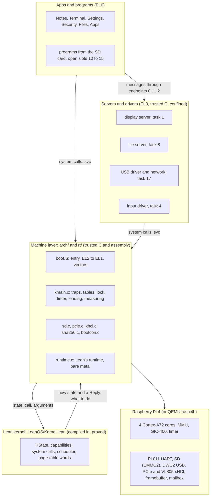
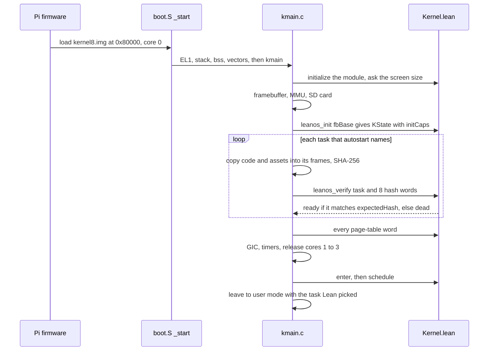
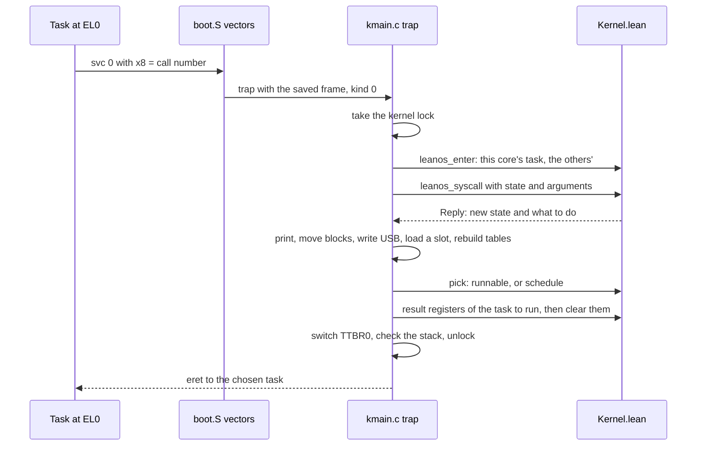
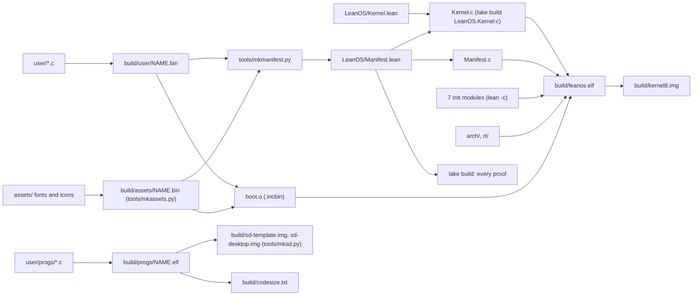

# How leanos is built

This document is for someone who has read the [README](../README.md) and wants to change
leanos: how the pieces fit, and where each decision lives, down to the file, the type, the
function and the theorem. It summarizes, and links to, three documents that go deeper:
[TRUST.md](../TRUST.md) (exactly what is proved and what is trusted),
[ROADMAP.md](../ROADMAP.md) (how each stage came to be, and what comes next) and
[SETUP.md](SETUP.md) (building, running, and the first boot on a real Pi 4).

Contents:

1. [The big picture](#1-the-big-picture)
2. [Boot](#2-boot)
3. [The kernel](#3-the-kernel)
4. [What is proved, and how it is kept honest](#4-what-is-proved-and-how-it-is-kept-honest)
5. [User space](#5-user-space)
6. [Policies enforced outside the kernel](#6-policies-enforced-outside-the-kernel)
7. [The build](#7-the-build)
8. [Testing](#8-testing)
9. [Source layout](#9-source-layout)
10. [Common changes, step by step](#10-common-changes-step-by-step)
11. [Glossary](#11-glossary)

## 1. The big picture

leanos has four layers. Trust runs one way: every task relies on the kernel, and the Lean
kernel relies on the machine layer, the runtime and the hardware to carry out what it
decides. Nothing relies on a task being well behaved.

| Layer | Where | Language | Proved? |
|---|---|---|---|
| The Lean kernel: every decision about who may touch what, and who runs next | [LeanOS/Kernel.lean](../LeanOS/Kernel.lean), [LeanOS/Manifest.lean](../LeanOS/Manifest.lean) | Lean 4, compiled to C | Yes: [LeanOS/Proofs.lean](../LeanOS/Proofs.lean) and the other proof files |
| The machine layer: boot, traps, page tables, interrupts, the four cores, the SD card, the firmware's mailbox, PCIe | [arch/](../arch) | C and AArch64 assembly | No: trusted |
| The runtime shim: what compiled Lean code needs (allocator, reference counts, arrays) | [rt/runtime.c](../rt/runtime.c), [rt/libc.c](../rt/libc.c) | C | No: trusted |
| User space: servers, drivers, built-in apps, programs from the SD card | [user/](../user), [user/progs/](../user/progs) | C, at EL0 | No, but confined by the kernel |



**The rule: the machine layer decides nothing.** The header of
[arch/kmain.c](../arch/kmain.c) states it: if a check in C would ever change an outcome, the
check belongs in `Kernel.lean`. Every system call goes to the Lean function `syscall`,
which returns a new state and a `Reply`: registers to load, bytes to print, tables to
rebuild, blocks to move, a program to load, a USB register to write. The C does exactly
that. The few checks C makes (a table of the wrong size, a number too large for the
runtime, a start of a slot the kernel should have refused) stop the machine with `kpanic`;
they exist only to catch the two halves disagreeing.

**Who trusts whom.**

- The Lean kernel trusts the machine layer to carry out every `Reply` faithfully, to say
  truly which task each core runs, and to store the page-table words it computes. TRUST.md,
  [Trusted, not proved](../TRUST.md#trusted-not-proved), lists each duty.
- Every task trusts the kernel. The kernel trusts no task: what a task can do is fixed by
  the capabilities the boot manifest (`initCaps`) gives its slot, and proved not to grow.
- Clients trust the servers they use with what passes through them: the display server
  sees every key and every window's pixels, the file server every file, the USB driver
  every network packet. The proofs bound what a server can *hold*, not what it does with
  the bytes it is shown.
- A program from the SD card is trusted by nobody. It runs in an open slot, reaches its own
  1 MiB, a window, its folder on the card and the files it was handed, and the network only
  if it was allowed.

## 2. Boot

The firmware reads `config.txt` (written by [tools/mkpiimage.py](../tools/mkpiimage.py))
and loads `kernel8.img` at `0x80000` (`kernel_address=0x80000`; `arm_64bit=1`,
`enable_gic=1`, `init_uart_clock=48000000`, no device tree). Under QEMU,
`qemu-system-aarch64 -M raspi4b -kernel build/kernel8.img` does the same.

[arch/boot.S](../arch/boot.S), `_start`: cores 1 to 3 stay parked in the firmware's spin
table. Core 0 checks it runs at the address [arch/kernel.ld](../arch/kernel.ld) links it
for (anywhere else it lights the green LED and stops), drops from EL2 to EL1 (`TO_EL1`, which
sets `HCR_EL2`, `CNTHCTL_EL2`, `CPTR_EL2`, `HSTR_EL2` and the rest rather than trust reset
values), sets its stack, enables floating point at EL1 only (EL0 traps it), clears `.bss`,
installs `vectors`, and calls `kmain`.

`kmain` in [arch/kmain.c](../arch/kmain.c) takes 13 steps. The boot console
([arch/bootcon.c](../arch/bootcon.c)) announces each before it runs, as `leanos: [n/13] ...`
on serial, on the screen once the framebuffer exists, and on the green LED on a Pi.
[SETUP.md](SETUP.md#first-boot-on-a-real-pi-4-what-to-expect) has the table of what each step
prints and what it means if the boot stops there. In short:

| Step | What happens | Lean involved |
|---|---|---|
| 1 `STAGE_UART` | PL011 at 115200 baud on GPIO 14 and 15 (`uart_init`, `uart_pins`) | |
| 2 `STAGE_BOARD` | the firmware's mailbox: board and firmware revisions, RAM (must cover the first 84 MiB), USB power, then PCIe and the VL805 on a Pi (`board_check`, `usb_a_ports`) | |
| 3 `STAGE_LEAN` | the Lean module's constants (`initialize_leanos_LeanOS_Kernel`) | yes |
| 4 `STAGE_FB` | 1024 x 600 x 32 from the firmware (`fb_alloc`), checked against what Lean asks for | `leanos_fb_width`, `_height`, `_pages` |
| 5 `STAGE_MMU` | the kernel's level-1 table from Lean, MMU and caches on (`mmu_init`) | `leanos_kernel_l1` |
| 6 `STAGE_SD` | the SD card and its 0xDA data partition ([arch/sd.c](../arch/sd.c)) | |
| 7 `STAGE_STATE` | the kernel's first state, `init fbBase`: 18 tasks with the manifest's capabilities | `leanos_init` |
| 8 `STAGE_MEMORY` | the whole frame pool cleared; SHA-256 checked against the FIPS 180-4 vector | |
| 9 `STAGE_PROGRAMS` | each task `autostart` names is loaded and measured (`load_program`, `measure_and_verify`) | `leanos_autostart`, `leanos_verify` |
| 10 `STAGE_TABLES` | every task's level-1, level-2 and level-3 tables (`tables_init`, `build_user_pages`) | `leanos_l1`, `leanos_l2`, `leanos_l3_table` |
| 11 `STAGE_IRQ` | the GIC: the lines Lean lists (`irqLines`); core 0's 10 ms timer (cores 1 to 3 start theirs as they come up) | `leanos_irq_line_count`, `leanos_irq_line` |
| 12 `STAGE_CORES` | cores 1 to 3 released through the spin table (`start_cores`); each runs `secondary` in boot.S, then `secondary_main` | |
| 13 `STAGE_FIRST` | the boot console stops drawing, and core 0 runs the first task Lean picks | `leanos_enter`, `leanos_schedule` |



**Measuring.** `load_program` clears all 256 of a slot's frames, copies the program's code
(from the table `user_progs` that boot.S builds with `.incbin`) to the start of its frames
and its asset blob (fonts and icons) to the start of its spare run. `measure_and_verify`
hashes exactly those bytes, code then assets, with SHA-256 ([arch/sha256.c](../arch/sha256.c))
and hands the eight words to Lean. `verify` compares them with `expectedHash`, the table
[tools/mkmanifest.py](../tools/mkmanifest.py) writes into
[LeanOS/Manifest.lean](../LeanOS/Manifest.lean): a match makes the task `ready`, a mismatch
makes it `dead` for good (`verify_refuses_mismatch`). An open slot has no entry: its program
is measured, recorded and runs (`only_verified_runs` covers both cases).

**The first tasks.** `autostart` in `Kernel.lean` names tasks 0 to 4 (Notes, the display
server, the two test tasks mallory and carol, the input driver), 8 (the file server) and
17 (the USB driver). The apps (Terminal, Settings, Security, Files, Apps) wait unloaded until
the display server starts them with `start`; at boot it starts Apps with `@startup`, which
opens what the card's `startup.txt` lists.

## 3. The kernel

Everything in this section is in [LeanOS/Kernel.lean](../LeanOS/Kernel.lean) unless another
file is named.

### 3.1 The state

`KState` is the whole kernel. The machine layer holds one reference to it (`K` in kmain.c)
and replaces it with whatever each Lean call returns.

| Field | What it holds |
|---|---|
| `tasks : List Task` | 18 tasks (`numTasks`), indexed by task number |
| `cur` | the task running on the core now in the kernel |
| `fbBase` | the framebuffer's physical address, fixed at boot |
| `pending` | interrupt lines that fired while nobody waited |
| `now` | timer ticks since boot, one every `tickMs` (10) ms |
| `usbDma`, `usbSize` | the DWC2's eight channels' DMA address and size, held back until a start is checked |
| `busy` | the tasks the other three cores run |
| `wall` | Unix seconds at tick 0, as the time's holder said (0: unknown) |
| `served` | for each of the 3 endpoints, the task whose message a receive took last |
| `next` | the task a wake-up chose to run next (`noTask`: none) |
| `turn` | where the round robin is |

A `Task` has `caps : List Cap`, `maps : List Mapping`, a `status` (`unverified`, `ready`,
`sending e m`, `receiving e deadline`, `awaiting server`, `sleeping wake`, `waitingIrq n`,
`dead`), `result` (the registers to load when it next runs), `callers` (its reply slots)
and `hash` (its measurement).

### 3.2 Tasks and slots

A slot is a task number. Each has 256 frames (1 MiB) of the frame pool and the capabilities
`initCaps` gives it; both are fixed. What runs in it may change (`start`, `exec`).

| Task | Program | Source |
|---|---|---|
| 0 | Notes (alice) | [user/alice.c](../user/alice.c) |
| 1 | the display server | [user/display.c](../user/display.c) |
| 2 | mallory, a test task that attacks | [user/mallory.c](../user/mallory.c) |
| 3 | carol, a test task that tries to run code she wrote | [user/carol.c](../user/carol.c) |
| 4 | the input driver (the UART) | [user/input.c](../user/input.c) |
| 5 | Terminal | [user/terminal.c](../user/terminal.c) |
| 6 | Settings | [user/settings.c](../user/settings.c) |
| 7 | Security | [user/security.c](../user/security.c) |
| 8 | the file server | [user/fs.c](../user/fs.c) |
| 9 | Files | [user/files.c](../user/files.c) |
| 10 to 15 | the open slots: programs from the SD card (`openSlot`) | [user/progs/](../user/progs) |
| 16 | Apps | [user/launcher.c](../user/launcher.c) |
| 17 | the USB driver, with the xHCI half and the network stack | [user/usb.c](../user/usb.c), [user/xhci.c](../user/xhci.c), [user/netstack.h](../user/netstack.h) |

The frame pool has room for 20 slots (`maxTasks`); the manifest uses 18.

### 3.3 Memory

**Physical.** RAM from 0 holds the firmware's spin table, the kernel image at `0x80000`,
four 64 KiB kernel stacks, and the kernel heap up to 64 MiB (`__heap_start` in
[arch/kernel.ld](../arch/kernel.ld) to `FRAME_BASE`). The frame pool starts at
`frameBase` = `0x04000000`: frame `f` is at `0x04000000 + 4096 f`, and task `i` owns frames
`256 i` to `256 i + 255` (`owner`). After the pool's 5,120 frames (`poolFrames`) come 600
framebuffer frames (`fbPages`, mapped to wherever the firmware put the screen) and one device
page, the PL011 UART (`devBase`, `devicePA`).

**Runs.** A task's frames are four capabilities (`frameCaps`):

| Capability | Run | Pages | Rights | Mapped at boot at |
|---|---|---|---|---|
| 0 | code | 16 (64 KiB) | read, execute | virtual pages 0 to 15 |
| 1 | data | 8 | read, write | pages 16 to 23 |
| 2 | stack | 4 | read, write | pages 8188 to 8191 |
| 3 | spare | 228 (the USB driver: 164) | read, write | not mapped; the task maps it itself |

The USB driver's last 64 frames are its xHCI memory, which it holds read-only
(`xhciCap`, capability 9). The machine layer loads a task's assets at the start of its
spare run.

**Virtual.** Every task sees a 32 MiB window of 8192 pages at `0x80000000` (`userBase`,
`userPages`). A `Mapping` says virtual page `vpn` shows physical `frame` with some rights.
`map(cap, page)` maps a whole run at consecutive pages with the capability's rights,
replacing what was there; `unmap` removes a range; `drop` removes a capability and every
mapping only it backed. No mapping is ever both writable and executable
(`no_write_execute`), and every mapping is backed by a capability the task holds with the
same rights (`maps_backed`).

**Page tables.** Lean computes every word the MMU reads. Level 1 (`l1Word`): entry 0 the
first GiB for the kernel (normal memory, never run from EL0), entry 2 the user window, entry
3 the peripherals (device memory, never run); level 2 (`l2Word`): 16 entries, one per level-3
table; level 3 (`l3Table`): all 8192 page descriptors of a task in one array, computed in
one pass over its mappings. The machine layer stores them in `tl1`, `tl2` and `tl3`, one set
per task, and switches with `TTBR0_EL1` and an ASID of task + 1. The kernel's own addresses
are identity-mapped. `walk_eq_view` in [LeanOS/Tables.lean](../LeanOS/Tables.lean) proves
that, against the MMU model in [LeanOS/Arm.lean](../LeanOS/Arm.lean), user mode then reaches
exactly its mappings. The VL805's registers at 24 GiB are mapped only in the machine
layer's own boot table `kl1`, which it switches to around an xHCI request.

### 3.4 Capabilities

A `Cap` is an object (`Obj`), `Rights` (three bits) and a badge.

| `Obj` | Names | `r` / `w` / `x` mean | Held by (manifest) |
|---|---|---|---|
| `frames base count` | a run of physical frames | read / write / execute | every task, its own four runs (the USB driver a fifth, its xHCI memory, read-only); the display the framebuffer; the input driver the UART page |
| `endpoint e` | a message queue | receive / send / grant | see 3.5 |
| `irq n` | an interrupt line | not used | input driver (153, the UART), USB driver (105, the DWC2) |
| `launch k` | the right to start and stop slot `k` | not used | display (0, 5, 6, 7, 9, 16); Terminal and Apps (10 to 15) |
| `blocks base count` | a run of 512-byte SD blocks | read / write | file server (1,048,576 blocks, 512 MiB) |
| `power` | switch off, restart | write | display server |
| `board` | the Pi's settings and sensors | read / write | Settings |
| `usbHost` | the DWC2 and the xHCI controller | read / write | USB driver |
| `wallClock` | the time of day | write | USB driver |

Only frame capabilities move. `derive(cap, rights, offset, count)` makes a new capability
with `Rights.meet` of the parent's rights and those asked, the same badge, and for frames a
sub-run (`subObj`); nothing is ever amplified (`derive_never_amplifies`). A send through an
endpoint with the grant right may carry one frame capability, which goes at the end of the
receiver's list (`grantOf`, `deliver`). Endpoints, interrupts, launch rights, blocks and
the machine capabilities never move and never gain rights (`endpoints_fixed`, `irqs_fixed`,
`launch_fixed`, `blocks_fixed`). A task holds at most 64 capabilities (`maxCaps`).

Because endpoints are fixed, so is the graph of who can grant to whom: `Edge A B` in
[LeanOS/Proofs.lean](../LeanOS/Proofs.lean) holds when `A` has send and grant on an
endpoint `B` receives on. `frame_flow` says a task holds a frame only along such edges from
its owner, and `edge_iff` lists the edges: into the display server, the file server and the
network service, and nowhere else. Memory moves at most one step.

### 3.5 Endpoints, badges and messages

| Endpoint | Receiver | Senders (badge = their task number, except Notes 1 and the input driver 3) |
|---|---|---|
| 0 | the display server (task 1) | Notes, Terminal, Settings, Security, Files, the open slots and Apps, with grant; mallory, the input driver and the USB driver without |
| 1 | the file server (task 8) | Notes, Terminal, Files, the open slots and Apps, with grant |
| 2 | the network service in the USB driver (task 17) | Terminal, the open slots and Apps, with grant |

A badge is fixed in the capability, and the kernel delivers it with every message, so a
server always knows who asks (`file_server_knows_the_sender`). Badges on endpoint 0: Notes
1, mallory 2, the input driver 3, and every other task its own number.

A message is the badge, three words and an optional grant (`Msg`). `send` delivers at once
to a task waiting to receive, or blocks; the woken receiver runs next on this core
(`wake`). `call` is a send that then waits (`awaiting`) for the reply, and runs the receiver
at once. `recv` takes a waiting sender's message, the first after the one this endpoint
served last, wrapping around (`findSender`, `served`), or blocks; `recvt` gives up after a
number of milliseconds (status 6, `eTimeout`). What arrives lands in the receiver's
registers: x0 = 0, x1 = badge, x2 to x4 = the words, x5 = 1 + the index of a granted
capability (or 0), x6 = 1 + the reply slot of a call (or 0).

A call takes a reply slot in the receiver's `callers` (at most 8, `maxCallers`).
`reply(slot, w0, w1, w2)` frees the slot and wakes the caller only if it still waits for
this task, with three words and no capability (`reply_grants_nothing`,
`reply_wakes_only_caller`). Messages are words, never memory: to pass bulk data a client
grants a frame run for one request (the file server's 4-page buffer, a window's pixels).

### 3.6 The system calls

A task makes a call with `svc #0`: the number in x8, arguments in x0 to x4, results in x0 to
x6 ([user/lib.h](../user/lib.h), `sys`). x0 is a status: 0 ok, 1 no such capability, 2 not
allowed or bad argument, 3 no such call, 4 full, 5 I/O error, 6 timed out. `runCall` is the
dispatch.

| # | Call | What it does | Who can |
|---|---|---|---|
| 0 | `write(va, len)` | prints up to 256 bytes of the caller's readable pages | any |
| 1 | `yield()` | lets the next task run | any |
| 2 | `map(cap, page)` | maps a frame run at consecutive pages | holder of a frame capability with read |
| 3 | `unmap(page, count)` | removes mappings | any |
| 4 | `derive(cap, rights, offset, count)` | a weaker copy, or part of a run | any holder |
| 5 | `exit()` | stops the caller | any |
| 6 | `capinfo(cap)` | kind, rights and size of a capability | any |
| 7 | `whoami()` | the caller's task number | any |
| 8 | `send(cap, w0, w1, w2, grant)` | a message, and optionally a frame capability | endpoint with send (grant needs grant) |
| 9 | `recv(cap)` | takes a message, or waits | endpoint with receive: tasks 1, 8, 17 |
| 10 | `call(cap, w0, w1, w2, grant)` | send, then wait for the reply | as `send` |
| 11 | `reply(slot, w0, w1, w2)` | answers a caller | a task holding that reply slot |
| 12 | `irqwait(cap)` | waits for the interrupt | input driver, USB driver |
| 13 | `irqack(cap)` | lets it fire again (`Reply.unmask`) | same |
| 14 | `bootinfo(task)` | a task's measurement status, the first two hash words, and whether it runs | any |
| 15 | `start(cap)` | (re)starts a manifest slot | display server (its launch capabilities) |
| 16 | `drop(cap)` | lets go of a capability | any |
| 17 | `blockread(cap, index, va, count)` | reads 1 to 32 blocks into the caller's writable pages | file server |
| 18 | `blockwrite(cap, index, va, count)` | writes 1 to 32 blocks from its readable pages | file server |
| 19 | `exec(cap, va, len)` | starts an open slot with the flat image at `va`, at most 64 KiB | Terminal, Apps |
| 20 | `sleep(ms)` | sleeps at least that long | any |
| 21 | `power(cap, action)` | switches off (0) or restarts (1) | display server |
| 22 | `time()` | ticks, milliseconds, h:m:s since boot, time of day | any |
| 23 | `board(cap, what, value)` | board and sensors, the activity LED, the CPU at 600, 1000 or 1500 MHz | Settings |
| 24 | `usb(cap, op, reg, value)` | a DWC2 register; a channel start only into the driver's own frames | USB driver |
| 25 | `recvt(cap, ms)` | `recv` with a timeout (0: do not wait) | as `recv` |
| 26 | `stop(cap)` | stops the running program in a slot, not the caller | holders of its launch capability |
| 27 | `setwall(cap, secs)` | says what time of day it is, in Unix seconds (more than the seconds since boot) | USB driver |
| 28 | `xhci(cap, op, x, y, z)` | xHCI registers, TRBs and input contexts, checked (3.9) | USB driver |

The machine layer turns each register into a Lean number with `arg`, which clamps it to
2^40 (every call refuses that), except the message words of `send`, `call`, `reply` and
`xhci`, which keep their low 63 bits (`msg_word`, `carries_words`). The runtime has no big
numbers; this keeps every sum the kernel computes below 2^63 (TRUST.md explains why that
is argued, not proved).

### 3.7 Scheduling across four cores

All four cores run tasks. The Lean state is one value, so one core at a time is in the
kernel: the machine layer takes a spin lock (`lock`, `unlock` in kmain.c) on every entry and
lets go just before `eret`. On every entry it first tells Lean which task this core runs and
which the other three run (`enter_lean`, calling `leanos_enter`), so `cur` is the caller and
`busy` the others.

- `runnable busy tasks j`: ready, and no other core runs it.
- `rotate`: the round robin. The first runnable task after `turn`, wrapping around.
- `schedule`: when the task here stops (it waits, yields, exits or faults), run `next`, the
  task a wake-up chose, if it is runnable; otherwise `rotate`. Either way `next` is spent.
- `wake`: a message or reply that wakes a task sets `next`, so it runs next here.
- `preempt`: an interrupt that wakes its holder runs it at once on this core; the task it
  displaced becomes `next`.
- Timer interrupts: on core 0, `tick` (the clock advances, sleepers and `recvt` deadlines
  wake, then `rotate`); on cores 1 to 3, `rotate` alone (`exRotate`).

`pick` in kmain.c runs what Lean chose, or calls `schedule`, or waits with WFI (without the
lock) if nothing may run here. `wake_others` sends an idle core the wake-up interrupt (SGI 0)
when a ready task is left over. Fairness is proved in [LeanOS/Fair.lean](../LeanOS/Fair.lean):
a ready task runs within 18 timer interrupts (`timer_bounded_wait`), and a blocked sender is
served before its server takes 18 other messages (`recv_bounded_wait`).

### 3.8 Time, interrupts, power and the board

- **The clock.** Each core's timer is set to an absolute counter value every 10 ms
  (`timer_rearm`, `CNTP_CVAL`); a late interrupt on core 0 passes Lean one `tick` per interval
  that ended, up to 100. `time` reports `now`; `sleep` rounds up to whole ticks
  (`sleep_on_time`); the clock never goes back (`clock_monotone`). The time of day is
  `wall` plus `now`, set only by the USB driver after asking an NTP server
  (`only_usb_driver_sets_time`).
- **Interrupts.** `irq_init` enables exactly `irqLines` (153 and 105) at the GIC, routed to
  core 0. `handle_irq` masks a line before calling `leanos_irq` (`irqFired`), which wakes the
  task in `waitingIrq` for it or records it in `pending`; the line is unmasked only when the
  holder's `irqack` returns `Reply.unmask`. Interrupts stay masked while the kernel runs.
  (The USB driver polls its controllers every 8 ms rather than waiting on its line.)
- **Power.** `power` returns `Reply.power`; the machine layer halts (semihosting exit under
  QEMU) or resets through the watchdog (`restart`). Only the display server can
  (`only_display_powers`); it does so from its menu, Restart or Shut down.
- **The board.** `boardRequest` turns `what` and `value` into one of `boardRequests`;
  `board_request` in kmain.c carries it out through the mailbox or GPIO 42
  (`cpu_never_overclocked`, `only_settings_touches_board`).

### 3.9 DMA checks for USB

The Pi 4 has no IOMMU, so the kernel keeps USB DMA inside the USB driver's own frames.

- **DWC2** (the USB-C port, and QEMU's USB). The driver reaches the registers only through
  `usb`. Writes to a channel's DMA address (`0x514`) and size (`0x510`) are held in `usbDma`
  and `usbSize`; a write to its characteristics that enables it starts the channel only if
  `dmaOk` finds the whole range, plus one packet of slack, in one of the driver's own frame
  runs with the right the direction needs. Registers that could aim DMA elsewhere are refused
  (`usbForbidden`). Theorem: `usb_dma_own_memory`.
- **xHCI** (the VL805 behind PCIe, the USB-A ports). Its rings, contexts and tables live in
  the driver's xHCI memory, which the driver holds read-only; only the kernel writes there,
  one TRB (`xTrbOk`, with a guard word written first, `xGuard`) or 16 bytes of an input
  context (`xCtxOk`) at a time, after checking every address in it. Register writes are
  filtered by `xWriteOk`; the DMA base registers are set only by `run` (op 2), with the
  kernel's own addresses. Theorem: `xhci_dma_own_memory` in
  [LeanOS/Xhci.lean](../LeanOS/Xhci.lean), against a model of the controller written from
  the xHCI specification. The machine layer's side is [arch/xhci.c](../arch/xhci.c) and
  [arch/pcie.c](../arch/pcie.c); QEMU has no PCIe, so there it is compiled but switched off.

### 3.10 Starting and stopping programs

`start` (15) and `exec` (19) both go to `sysStart`. With a launch capability for slot `k`
that is not running (`startable`: never started, or stopped), not the caller's own slot,
and an image the caller has mapped readable (`imageOk`: none for a manifest slot, 1 byte to
64 KiB for an open slot), it:

1. takes back from every task everything that reaches slot `k`'s frames: capabilities,
   mappings, grants waiting in messages, and reply slots held for its last run
   (`revokeAll`, `revokeTask`);
2. puts a fresh `mkTask k` in the slot, `unverified`;
3. returns `Reply.load = k + 1` (and for `exec`, `loadLen` and `outVa`).

The machine layer then, in this order: makes any other core running slot `k` leave user mode
(`evict`), rebuilds every task's level-3 tables, clears the slot's 256 frames and copies in
the program (`load_program` from the kernel image, or `load_image` from the caller's memory,
with the open slots' shared fonts at the start of the spare run), measures it
(`measure_and_verify`), and prints the kernel heap. `start_revokes` proves nothing of the
old run survives.

`stop` (26) marks a running slot `dead`, as a fault would; what it shared is taken back at
the next start. The display server, Terminal and Apps hold the launch capabilities
(`only_launchers_stop`); in practice Terminal (`kill`) and Apps (Force Quit) use it.

### 3.11 From Lean to C, and the boundary

`Kernel.lean` is a `prelude` module that imports only `Init.Core`, `Init.Data.Array.Set` and
`LeanOS.Manifest`, and writes its own list helpers (`nth?`, `setNth`, `snoc`, `len`,
`app`), so the image carries seven small modules of Lean's standard library and nothing that
needs an operating system. `lake build LeanOS.Kernel:c` writes
`.lake/build/ir/LeanOS/Kernel.c`; the Makefile compiles it, `Manifest.c` and the seven
`Init` modules (compiled from the toolchain's sources with `lean -c`) with clang for
`aarch64-none-elf`, freestanding, and links them with arch/ and rt/.

**The runtime shim.** [rt/runtime.c](../rt/runtime.c) (about 450 lines) is the part of
Lean's runtime compiled code calls: a size-class allocator over the kernel heap, reference
counting and freeing through a fixed stack (no recursion), closures, arrays, and panics
for everything else. Numbers are only small (boxed below 2^63); a big one stops the machine.
It is not thread-safe, which is why the kernel lock exists.

**Loops proved equal.** Written plainly, `app`, `snoc`, `len`, `dropRange`, `runMaps`,
`removeNth`, `keepBacked`, `dropCaps` and `dropMaps` would take a kernel stack frame per
list element, and a task may hold 8192 mappings. Each has a tail-recursive twin (`appTR`,
`dropRangeTR` and so on, built on `revOnto`), and a `@[csimp]` theorem proving the two equal
(`app_eq_appTR` and eight more). The compiler then runs the loop wherever the kernel calls
the original, while the proofs stay about the original. The kernel's worst stack use is
computed from the code by [tools/stackcheck.py](../tools/stackcheck.py) (7,008 bytes, of
64 KiB per core, when TRUST.md was last updated).

**The boundary.** Lean functions marked `@[export leanos_...]` are what C calls; exported
functions consume their arguments, so C passes `K1` (`lean_inc(K), K`) to a query and
hands `K` over to an update.

| C (arch/kmain.c unless noted) | Lean entry points | Lean definition |
|---|---|---|
| `kmain` | `initialize_leanos_LeanOS_Kernel`, `leanos_init`, `leanos_ntasks`, `leanos_autostart` | `init`, `autostart` |
| `fb_alloc` | `leanos_fb_width`, `leanos_fb_height`, `leanos_fb_pages` | `fbWidth`, `fbHeight`, `fbPages` |
| `mmu_init`, `tables_init`, `build_user_pages` | `leanos_kernel_l1`, `leanos_l1`, `leanos_l2`, `leanos_l3_table` | `kernelL1Word`, `l1Word`, `l2Word`, `l3Table` |
| `irq_init` | `leanos_irq_line_count`, `leanos_irq_line` | `irqLines` |
| `measure_and_verify` | `leanos_verify`, `leanos_open_slot`, `leanos_ready` | `verify`, `openSlot` |
| `load_program` | `leanos_xhci_base` | `xhciBase` |
| `xhci_boot_word` (used by [arch/xhci.c](../arch/xhci.c)) | `leanos_xhci_boot` | `xhciBoot` |
| `enter_lean` (every trap, every idle wake-up) | `leanos_enter` | `enter` |
| `handle_irq` | `leanos_tick` (core 0's timer), `leanos_rotate` (cores 1 to 3), `leanos_irq` | `tick`, `rotate`, `irqFired` |
| `do_syscall` | `leanos_syscall`, then `leanos_reply_*` (out_va, out_len, remap, unmask, load, load_len, power, io, io_block, board, usb_op, usb_a to usb_d, xhci_op, state) | `syscall`, `Reply` |
| `do_syscall`, after carrying a Reply out | `leanos_io_failed`, `leanos_board_done`, `leanos_usb_done` | `ioFailed`, `boardDone`, `usbDone` |
| `usb_request` (a register read) | `leanos_usb_done` | `usbDone` |
| `trap` (a fault from EL0) | `leanos_fault` | `killCurrent` |
| `pick` | `leanos_cur`, `leanos_runnable`, `leanos_schedule`, `leanos_dead` | `schedule`, `runnable` |
| `load_result` (in `leave`) | `leanos_result_len`, `leanos_result`, `leanos_clear_result` | `clearResult` |
| `wake_others` | `leanos_ready` | `isReady` |



## 4. What is proved, and how it is kept honest

**Reachable states.** `Reachable` in [LeanOS/Proofs.lean](../LeanOS/Proofs.lean) is every
state from `init fb`, for any framebuffer address, through any sequence of system calls with
any arguments, ticks, faults, result loads, interrupts on any line, boot checks with any
measurement, I/O failures, board and USB results, core entries, `schedule` and `rotate`.
`Step` in [LeanOS/Fair.lean](../LeanOS/Fair.lean) is one such step, for statements about
runs. `Driven` in [LeanOS/Bounds.lean](../LeanOS/Bounds.lean) narrows two steps to what the
machine layer actually passes (eight hash words, lines in `irqLines`), and every `Driven`
state is `Reachable`. The core invariant is `Inv` (each task's capabilities, mappings and
status are `TaskOK`), proved for every reachable state by `reachable_inv`.

The proof files, and their headline theorems:

| File | Theorem | In one line |
|---|---|---|
| [Proofs.lean](../LeanOS/Proofs.lean) | `frame_flow` | a task holds a frame only along grant edges from its owner, never with more rights |
| | `confined` | every task but the display server, the file server and the USB driver holds only its own frames |
| | `endpoints_fixed`, `file_server_knows_the_sender` | endpoint capabilities keep their rights and badge, so a sender cannot pass for another |
| | `no_write_execute`, `maps_backed`, `maps_in_range` | no page writable and executable; every mapping backed by a capability; all inside the window and the pool |
| | `derive_never_amplifies` | a derived capability allows nothing its parent does not |
| | `only_verified_runs`, `verify_refuses_mismatch` | a manifest slot runs only the code and assets the manifest names |
| | `exec_reads_only_readable`, `start_revokes` | a program image comes from the loader's readable pages, and a start leaves nothing of the slot's last run |
| | `block_run_confined`, `disk_only_file_server` | block I/O stays in the file server's blocks and its own mapped pages |
| | `usb_dma_own_memory` | the DWC2's DMA only ever reaches the USB driver's own frames |
| | `only_display_powers`, `cpu_never_overclocked`, `only_usb_driver_sets_time` | who may switch off, change the board, set the time |
| | `clock_monotone`, `sleep_on_time` | the clock never goes back, and `sleep` never ends early |
| | `schedule_picks_ready`, `schedule_not_on_other_core`, `wake_runs_next`, `irq_runs_holder` | the scheduler picks a ready task no other core runs, and a woken task runs next |
| | `only_launchers_stop` | only the display server, Terminal and Apps can stop a program |
| [Tables.lean](../LeanOS/Tables.lean) | `l3Table_spec` | the one-pass level-3 table holds `l3Word` at every index |
| | `walk_eq_view` | through the stored tables, user mode reaches exactly its mappings and nothing of the kernel's |
| | `el0_no_write_execute`, `el0_flow`, `el0_mallory_isolated` | the same guarantees, stated for what the MMU allows |
| [Arm.lean](../LeanOS/Arm.lean) | (none) | the trusted model of the Armv8-A stage-1 walk (`walkEL0`), about 90 lines |
| [Bounds.lean](../LeanOS/Bounds.lean) | `task_bounded` | at most 64 capabilities, 8192 mappings, 8 reply slots and 7 result registers per task |
| | `state_bounded`, `stateSize_le` | the whole state is at most 447,559 heap objects (`stateMax`) |
| [Fair.lean](../LeanOS/Fair.lean) | `recv_in_turn`, `recv_bounded_wait` | a server takes waiting senders in turn; while one waits, the server takes fewer than 18 other messages |
| | `turn_only_by_round_robin`, `timer_bounded_wait` | a ready task runs within 18 timer interrupts |
| [Xhci.lean](../LeanOS/Xhci.lean) | `xhci_dma_own_memory` | whatever the driver asks, the controller (as modelled) touches only the driver's own frames or the right part of the xHCI memory |
| | `xhci_region_readonly`, `xhci_boot_ok`, `xhci_guard_safe`, `xhci_layout` | the xHCI memory is the driver's read-only; its boot content, half-written TRBs and layout are safe |
| [JournalModel.lean](../LeanOS/JournalModel.lean), [Journal.lean](../LeanOS/Journal.lean) | `crash_atomic` | for the model of the file server's journal (`protocol`, `recover`), a power cut after any number of block writes leaves every block as before the change or as after it |

TRUST.md has the full table, statement by statement ([Proved](../TRUST.md#proved)), and
every theorem can be browsed in [LeanViz](https://keithadler.github.io/leanviz/?p=leanos).

**Keeping it honest.**

- **Axioms.** [test/Axioms.lean](../test/Axioms.lean) runs `#print axioms` on 109
  declarations, the headline theorems and the nine `@[csimp]` equations among them.
  [test/boot.sh](../test/boot.sh) fails if anything but `propext`, `Classical.choice` and
  `Quot.sound` appears, or `sorryAx`.
- **Mutants.** A mutant is a small, deliberate break of the kernel (a `derive` that keeps
  the parent's rights, a receive that searches from task 0, a TRB whose buffer goes
  unchecked). [test/mutants.sh](../test/mutants.sh) lists 167: 163 in `Kernel.lean` and 4
  in `JournalModel.lean`, each a name, a piece of text and its replacement.
  [test/mutants.py](../test/mutants.py) applies each in its own copy of the project,
  requires that the mutated kernel still compiles, and that the whole build, proofs
  included, then fails. `make mutants` runs them.
- **The trusted base** is listed in [TRUST.md](../TRUST.md#trusted-not-proved): Lean's
  compiler and kernel, clang, the runtime shim, the machine layer, the MMU and xHCI models,
  the firmware and the hardware.

## 5. User space

Every program is freestanding C, compiled with `-mgeneral-regs-only` (no floating point)
and linked by [user/user.ld](../user/user.ld) at `0x80000000`, with no writable globals: its
state lives in its data pages (`DATA`, `0x80010000`) or its spare run. It enters at
`_start` in section `.text.start`. [user/lib.h](../user/lib.h) has the system calls,
[user/gfx.h](../user/gfx.h) the drawing, [user/assets.h](../user/assets.h) the fonts and
icons, [user/app.h](../user/app.h) the display protocol's client side, and
[user/fs.h](../user/fs.h) the file server's.

### 5.1 The built-in tasks

Capability numbers are indexes in the task's list; 0 to 3 are always its frame runs.

| Task | Name | Badge | Holds, beyond its own frames | Serves |
|---|---|---|---|---|
| 0 | Notes | 1 | send and grant to the display (4) and the file server (5) | |
| 1 | display server | | receive on endpoint 0 (4), the framebuffer (5), launch 0, 5, 6, 7, 9 (6 to 10), power (11), launch 16 (12) | endpoint 0: windows, input, clipboard, desktop |
| 2 | mallory | 2 | send to the display, without grant (4) | (a test: tries every attack) |
| 3 | carol | | nothing but her frames | (a test: tries to run what she wrote) |
| 4 | input driver | 3 | send to the display (4), the UART page (5), UART interrupt 153 (6) | keys and mouse from the serial line |
| 5 | Terminal | 5 | display (4), file server (5), launch 10 to 15 (6 to 11), network (12) | |
| 6 | Settings | 6 | display (4), board (5) | |
| 7 | Security | 7 | display (4) | |
| 8 | file server | | receive on endpoint 1 (4), SD blocks (5) | endpoint 1: files |
| 9 | Files | 9 | display (4), file server (5) | |
| 10 to 15 | open slots | 10 to 15 | display (4), file server (5), network (6) | |
| 16 | Apps | 16 | display (4), file server (5), launch 10 to 15 (6 to 11), network (12) | |
| 17 | USB driver | 17 | send to the display (4), USB interrupt 105 (5), USB controllers (6), receive on endpoint 2 (7), time of day (8), xHCI memory read-only (9) | endpoint 2: the network; keys and mouse from USB |

### 5.2 The display server

[user/display.c](../user/display.c) owns the framebuffer and composites every window from
pixels its program lent it (read-only frame grants), drawing through a band of its own
memory. It never blocks on a client: it holds each program's waiting call until it has an
event, at most 7 at once (`HOLD_MAX`), since the kernel gives it 8 reply slots.

Requests (`OP_` in [user/app.h](../user/app.h); display.c keeps its own copy of the
numbers, and so do input.c and usb.c of the events they send). Each is a `call` on
endpoint 0 with the op in `w0`; the answer's x1 is 0 for yes.

| Op | Name | What | Who may |
|---|---|---|---|
| 1 | `OP_OPEN` | a window: width, height (and `OPEN_DRAG`, bit 32), 8 bytes of title, a read-only grant of the pixels; answers the window's number | any sender with grant |
| 2 | `OP_WAIT` | the next event for any of the caller's windows (held until there is one) | any |
| 3 | `OP_SET` | the background or the time zone | Settings; Apps once at boot with what it saved |
| 4 | `OP_POLL` | the next event, or none at once | any |
| 5 | `OP_ICON` | the program's icon and name: four pages of its code run, with execute, starting with the loader's marker | open slots 10 to 15 |
| 6 | `OP_START` | start a built-in app from the dock | Apps |
| 7 | `OP_RAISE` | bring a card program's windows forward, by file name; with no name, forget stopped programs' windows (`app_before_start`) | any |
| 8 | `OP_PENDING` | which program (and file) the dock or Files wants started | Apps |
| 9 | `OP_ZONE` | the time zone and background | any |
| 10 | `OP_COPY` | 16 bytes of text answering an `EV_COPY` | the window that was asked, within 2 s |
| 12 | `OP_CLOSE` | close one of the caller's windows | any, its own windows |
| 13 | `OP_OPEN_WITH` | open a file in a program, from a page lent read-only | Files, right after the user's key or click in its window |
| 14 | `OP_PROGRAM` | what the display knows of an open slot, for Force Quit | Apps |

Op 11 is deliberately no request: nothing reads the clipboard.

Events (`EV_`), in the answer to `OP_WAIT` or `OP_POLL`: x1 is the kind with the window's
number from bit 8 (`EV_WIN`), x2 and x3 the values. 1 `EV_KEY` (a byte, or 128 and up for
the arrows, Home, End, Delete, Page Up and Down, their Shift forms, F1 to F12), 2 `EV_DOWN`,
3 `EV_UP`, 4 `EV_MOVE`, 5 `EV_CLOSE`, 6 `EV_LAUNCH` (to Apps only), 7 `EV_COPY` (a =
`COPY_CUT` for a cut), 8 `EV_PASTE` (16 bytes a event), 9 `EV_RDOWN`, 10 `EV_RUP`. A plain
window hears only the left press; an `OPEN_DRAG` window holds the pointer from a press to
the release and hears moves, the release and the right button.

The input and USB drivers send input as plain `send`s with an `EV_` kind in `w0`; the
display recognizes them by badge (3, 17). It also keeps the dock (Notes, Files, Terminal,
Settings, Security, Apps, then Clock, Calculator, Tour and Web from the card, which it asks
Apps to start), the menu bar (the leanos menu with Restart and Shut down, the Edit menu,
the Window menu, the clock in the chosen time zone), minimize, zoom and Ctrl+O.

### 5.3 The file server and the journal

[user/fs.c](../user/fs.c) receives on endpoint 1 and alone holds the card's data partition.
Every request is a `call` with the op in `w0`, an argument in `w1`, and a grant of the
client's 4-page buffer (the last four pages of its spare run, `FS_BUF_OFFSET`): a path at
byte 0 (up to 200 bytes), an offset at byte 248, data from byte 256. The server maps the
buffer, does the work, unmaps it and drops the capability before it replies. The answer:
x1 a status (`FS_OK`, `FS_NOT_FOUND`, ..., `FS_DENIED`), x2 and x3 a count, size or kind.

Operations ([user/fs.h](../user/fs.h)): 1 `LIST`, 2 `READ`, 3 `WRITE`, 4 `DELETE`, 5
`WRITE_AT`, 6 `MKDIR`, 7 `STAT`, 8 `RENAME` (one step), 9 `SHARE`, 10 `UNSHARE`, 11
`GRANTS`, 12 `SPACE`. One request moves at most 16,128 bytes (`FS_CHUNK`).

**Who reaches what** (`allowed` in fs.c, by badge): Notes, Terminal, Files and Apps reach
the whole card. A program in an open slot reaches only what was shared with its slot:
Terminal, Files and Apps may `SHARE` a path with read and/or write, up to 8 per slot
(`FS_GRANTS_PER_SLOT`: its folder `apps/NAME` and 7 more), and `UNSHARE` takes all of a
slot's back. Everything else is `FS_DENIED`, with nothing more said.

**On the card**: a superblock, the journal (a header and up to 124 blocks), a bitmap of
4 KiB clusters, 1024 inodes (12 direct clusters, one indirect, one double indirect), and
data; a folder is a file of 64-byte entries. Every change is one transaction: the changed
blocks go to the journal, then a header with a checksum (the commit), then each block to its
place, then a clean header; at start, a committed journal is replayed, and the whole tree is
checked and repaired. [tools/mksd.py](../tools/mksd.py) writes the same format. The model
and its proof, `crash_atomic`, are in [LeanOS/JournalModel.lean](../LeanOS/JournalModel.lean)
and [LeanOS/Journal.lean](../LeanOS/Journal.lean); that fs.c follows the model is tested,
not proved (TRUST.md, Known gaps).

### 5.4 USB, input and the network

- **The USB driver** ([user/usb.c](../user/usb.c)) drives the DWC2 through `usb`: host mode
  with buffer DMA, control and interrupt transfers, hubs, HID boot keyboards and mice, and
  absolute pointers (touchscreens, QEMU's tablet). Its xHCI half ([user/xhci.c](../user/xhci.c),
  included by usb.c) drives the VL805 through `xhci`: root ports, hubs up to four deep,
  devices plugged at any time, boot keyboards and mice. Both send keys and pointer events to
  the display with badge 17. Every DMA address it uses is checked by the kernel (3.9), so a
  wrong one is refused, not followed.
- **The network.** The same task serves endpoint 2, the network service
  ([user/net.h](../user/net.h): `NET_INFO`, `NET_PING`, `NET_GET`, `NET_READ`, `NET_TIME`,
  `NET_ALLOW`), on a small client stack in [user/netstack.h](../user/netstack.h) over the USB
  network adapter (DHCP, DNS, ICMP, TCP, HTTP/1.0, SNTP). Requests use the same 4-page
  buffer grant as the file server. A program in an open slot is answered only if its slot
  was allowed for that program's hash (`run -net` in Terminal; Apps allows `web`). The stack
  is being reworked, so this document stops at its interface.
- **The input driver** ([user/input.c](../user/input.c)) holds the UART and its interrupt,
  and turns bytes into events: a plain byte is a key; `ESC m` then `d`, `u`, `D`, `U` or `v`
  and x and y as three digits each is a mouse report (left down, left up, right down, right
  up, move); the arrow, Home, End, Delete, Page and function keys come as a terminal sends
  them (`ESC [ A`, `ESC [ 5 ~`, `ESC O P`, with `;2` for Shift). On QEMU the browser console
  ([tools/serve.py](../tools/serve.py)) and the tests write these; on a Pi, any serial
  terminal ([tools/serial.py](../tools/serial.py)).

### 5.5 Programs on the SD card

A program on the card is an AArch64 ELF file (built from [user/progs/](../user/progs),
stripped). The kernel never parses ELF:

1. **Loading, in user space.** Terminal (`run [-net] NAME [FILE...]`) or Apps reads the
   file through the file server and builds a flat image (`elf_load` in
   [user/elfload.h](../user/elfload.h), rules in [user/elf.h](../user/elf.h)): entry at
   `0x80000000`, no writable segment, everything inside the 64 KiB code run, and no page that
   already starts with the icon marker. If the image fits in 48 KiB, the loader writes the
   marker `LNIC`, the icon from `NAME.icon` (if the card has one) and the file's name into
   pages 12 to 15 (`image_add_icon`).
2. **A slot.** It picks an open slot that is not running (`bootinfo`, x4 = 1 means running),
   takes back what the slot was given before and shares `apps/NAME` and any named files
   (`fs_unshare`, `fs_share`), tells the display (`app_before_start`), and calls `exec`.
3. **Verification.** The kernel revokes the slot's old run and the machine layer loads,
   clears and measures the image (3.10). An open slot is not in the manifest, so any image
   runs; its hash is recorded, shown by Security and Terminal's `boot`, and used by the
   network service.
   What it may do is fixed by the slot's capabilities, whatever it is.
4. **The network**, if asked, with `NET_ALLOW` for the slot.

What a program in an open slot can reach: its own 256 frames, a window from the display
server, its folder and handed files through the file server, and the network if allowed.
`confined` proves it holds only its own frames; everything else is the servers' C.

**Its memory** (user/app.h, user/fs.h), in virtual pages of its window:

| Pages | What |
|---|---|
| 0 to 15 | code run, read and execute (the image; pages 12 to 15 the icon and name, if any) |
| 16 to 23 | data run, read-write (`DATA`) |
| 64 to 291 | the spare run, once the program maps it (`app_assets`, `SPARE_PAGE`): spare pages 0 to 63 the shared fonts (`OPEN_ASSETS` in the Makefile, [user/ui.h](../user/ui.h)), from 64 the window's pixels (`APP_WIN_OFFSET`, at most `APP_WIN_PAGES` = 164), and 224 to 227 the buffer it lends the file server and the network (`FS_BUF_OFFSET`) |
| 8188 to 8191 | stack, read-write |

A window that uses all 164 pages would reach the buffer's four; programs size their windows
below that.

**Stopping.** A program exits on `EV_CLOSE` (or `exit`), faults (the kernel marks it dead),
or is stopped: Terminal's `kill SLOT` and Apps' Running view (Force Quit, Ctrl+Q) call
`stop` with the slot's launch capability and `fs_unshare`. The display forgets a stopped
program's windows before it answers any call.

## 6. Policies enforced outside the kernel

Some rules are about what the user did with their hands, which the kernel cannot see. They
live in trusted C servers. The kernel proves what they rest on (a badge cannot be forged,
`endpoints_fixed`; memory lent to a server goes no further, `server_frames`), not the rule.

| Policy | Enforced in | Rule | Documented | Tested by |
|---|---|---|---|---|
| The clipboard | `copy_ask`, `on_copy`, `paste_to` in [user/display.c](../user/display.c) | text is taken only after Ctrl+C or Ctrl+X (or Edit), only from the window asked, within 2 s; handed only to the window in front on Ctrl+V; no request reads it | [TRUST.md](../TRUST.md#trusted-not-proved), user/app.h | [test/clipboard.sh](../test/clipboard.sh), [test/dfuzz.sh](../test/dfuzz.sh) |
| Opening files | `on_open_with`, `on_pending` in display.c; `start` in [user/launcher.c](../user/launcher.c) | only Files, only with its window in front, within 2 s of the user's key or click in it, once per key or click; only Apps learns what to open, and gives the program its folder and that one file | TRUST.md, user/app.h | [test/open-with.sh](../test/open-with.sh) |
| Force quit | Apps' Running view (launcher.c), Terminal's `cmd_kill` | `stop` needs a launch capability, which only the display, Terminal and Apps hold (`only_launchers_stop`); Apps asks for confirmation | launcher.c's header | [test/force-quit.sh](../test/force-quit.sh), [test/kill.sh](../test/kill.sh) |
| Window names | `on_icon` in display.c, `image_marked` and `image_add_icon` in user/elf.h | a name comes only from four executable pages of the program's own code run, starting with the loader's marker | TRUST.md | [test/spoof.sh](../test/spoof.sh) |
| What a card program may open | `allowed` in [user/fs.c](../user/fs.c) | its folder and what was shared with its slot | TRUST.md, Known gaps | [test/fsfuzz.sh](../test/fsfuzz.sh), [test/grants.sh](../test/grants.sh) |
| The desktop's settings | `on_set` in display.c | only Settings changes the time zone and background (Apps once at boot, from `settings.txt`) | TRUST.md | [test/timezone.sh](../test/timezone.sh) |
| The network for card programs | the USB driver's allow table ([user/net.h](../user/net.h)) | answered only for the program hash allowed in that slot | user/net.h | [test/web.sh](../test/web.sh) |

## 7. The build

`make` builds everything and checks every proof. The pieces:



- **User programs.** Each built-in (`USER_PROGS`: alice, display, mallory, carol, input,
  terminal, settings, security, fs, files, launcher, usb) is compiled, linked by user.ld and
  turned into a flat `.bin`. Asset blobs (fonts rasterized and icons scaled by
  [tools/mkassets.py](../tools/mkassets.py)) exist for Notes, the display, Terminal,
  Settings, Security, Files, Apps, and `open` for the open slots.
- **The manifest.** [tools/mkmanifest.py](../tools/mkmanifest.py) hashes each task's code
  followed by its assets (`MANIFEST_INPUTS`, in task order, `""` for the six open slots) and
  writes [LeanOS/Manifest.lean](../LeanOS/Manifest.lean), which is generated and committed.
  Its rule depends on `FORCE` and always runs: every build product is `.SECONDARY`, so in a
  fresh tree make would take the committed manifest as up to date even when a program's
  source changed, and link a kernel that refuses that program at boot. The script rewrites
  the file only when a hash changed, so nothing downstream rebuilds for nothing.
- **The kernel.** `Kernel.c` and `Manifest.c` from lake, the seven `Init` modules, arch/ and
  rt/, and `boot.o`, which embeds every built-in's `.bin` and asset blob with `.incbin`, are
  linked at `0x80000` into `build/leanos.elf` and copied to `build/kernel8.img`.
- **The proofs.** `proofs` runs `lake build`: every module in [LeanOS.lean](../LeanOS.lean).
  `make proofs` does only that.
- **Cards.** The card programs (`DISK_PROGS`: hello, clock, tour, calc, snake, life, tiles,
  fuzz, edit, web, mines, calendar, view, paint, solitaire) go on an 8 MiB image with their
  icons and `guide.txt` ([tools/mksd.py](../tools/mksd.py)): `build/sd-template.img`, which
  the tests boot, and `build/sd-desktop.img`, which adds `startup.txt` and view's sample
  pictures. `make run` copies the latter to `build/sd.img` once and keeps it.
- **Pi cards.** `make pi-image` builds `build/pi/kernel8.img` (kmain.c and bootcon.c without
  `LEANOS_QEMU`: switching off halts, and the LED shows the boot) and
  [tools/mkpiimage.py](../tools/mkpiimage.py) writes `build/leanos-pi4.img`: 128 MiB, a
  64 MiB FAT16 boot partition with the firmware (from
  [tools/fetch-firmware.sh](../tools/fetch-firmware.sh)), `config.txt` and the kernel, then
  the 0xDA data partition. `make pi-bringup` adds `LEANOS_BRINGUP` (LED blink codes for each
  step, step times, more of the board); `make pi-selftest` is the bring-up card with
  [user/progs/selftest.c](../user/progs/selftest.c) first and
  [docs/card/startup-selftest.txt](card/startup-selftest.txt). SETUP.md covers using them.
- **Code size.** [tools/codesize.py](../tools/codesize.py) writes `build/codesize.txt` and
  prints how much of its 64 KiB code run each program uses, failing if one is over (the
  linker checks too). A card program over 48 KiB runs without its icon.
- **Stack check.** `make stackcheck` compiles every kernel C file again into `build/stack/`
  with `-fstack-usage`, and [tools/stackcheck.py](../tools/stackcheck.py) checks the code
  matches the shipped objects, reads the call graph from `build/leanos.elf`, bounds each
  recursion by its table (`RECURSION`, each from a proved bound on a list in the state), and
  fails over half the 64 KiB stack.

## 8. Testing

`make test` runs [test/all.py](../test/all.py): 49 tests, each a shell script
`test/NAME.sh` run in its own folder `build/test/NAME` (its card, its screens, its output),
several at once (`JOBS`, default half the cores, at most 4), the longest first. Tests that
start servers on the host (net, web, timezone, calendar, term-more) form one chain and run
one after another. `test/all.py NAME...` runs some.

- **[test/run.py](../test/run.py)** boots QEMU's `raspi4b`, headless, with a card (a copy of
  `sd-template.img`, a blank one, or a raw one), prints the serial console, and, once the
  kernel reports it is idle, types the test's steps into the serial line: bytes, mouse
  reports (`mouse`, `wclick` at a window's position read from the log), waits for a line
  (`wait_for`), screen captures through QEMU's QMP socket (`snap`, `screendump`), and USB
  input through QMP `input-send-event` for a USB keyboard, mouse or tablet (`usb_key`,
  `usb_mouse`, `usb_touch`). Tests then check the transcript and pixels of the capture.
- **Boot and proofs.** [test/boot.sh](../test/boot.sh) checks the axioms, the boot
  transcript and the screen; [test/tamper.sh](../test/tamper.sh) flips a bit of carol's code
  in the image and expects only carol refused.
- **Fuzzers.** [test/fuzz.sh](../test/fuzz.sh) runs [user/progs/fuzz.c](../user/progs/fuzz.c)
  from an open slot: 20,000 system calls with made-up arguments, each answer checked against
  what the proofs promise. [test/fsfuzz.sh](../test/fsfuzz.sh) and
  [test/dfuzz.sh](../test/dfuzz.sh) fuzz the file server and the display server the same
  way, from several slots at once, with fixed requests for every bug found so far; the seed
  is printed.
- **Limits.** [test/chaos.sh](../test/chaos.sh) fills every list the kernel keeps and checks
  the heap returns to the same byte count after restarts; [test/stack.sh](../test/stack.sh)
  measures the deepest stack, [test/stackcheck.sh](../test/stackcheck.sh) computes it;
  [test/fair.sh](../test/fair.sh), [test/responsive.sh](../test/responsive.sh) and
  [test/freeze.sh](../test/freeze.sh) check servers serve in turn and input stays prompt.
- **Power cuts.** [test/crash.sh](../test/crash.sh) kills the machine at random moments
  twelve times while Terminal rewrites a 200 KB file, and requires a clean check and one
  whole version each time; [test/power.sh](../test/power.sh) restarts and switches off from
  the menu.
- **The xHCI simulator.** QEMU has no PCIe. [test/xhci.sh](../test/xhci.sh) compiles
  [user/xhci.c](../user/xhci.c) and [arch/xhci.c](../arch/xhci.c) for the host with
  [test/xhci-sim/sim.c](../test/xhci-sim/sim.c), a model of an xHCI controller and devices
  (hubs, keyboards, mice, a USB 3 drive) that checks every address the controller follows.
  Each `xhci` call the driver makes goes to
  [test/xhci-sim/Oracle.lean](../test/xhci-sim/Oracle.lean), which runs the real `sysXhci`
  on it, so the kernel's checks are never copied into C.
- **Cards for a Pi.** [test/piimage.sh](../test/piimage.sh) checks the Pi image's FAT
  partition and that leanos never touches it; [test/selftest.sh](../test/selftest.sh) boots
  the self-test card under QEMU.
- **Mutants.** `make mutants` (section 4), separate from `make test`.

## 9. Source layout

```text
LeanOS.lean          the library's root: imports every module below
LeanOS/
  Kernel.lean        the kernel: state, capabilities, system calls, scheduler, page tables
  Manifest.lean      generated by tools/mkmanifest.py: each task's expected SHA-256
  Proofs.lean        the invariant, Reachable, and the main theorems
  Tables.lean        the page tables give user mode exactly its mappings
  Arm.lean           the trusted model of the MMU's translation walk
  Bounds.lean        the state never grows past a fixed size
  Fair.lean          fair receive and fair running
  Xhci.lean          a model of the xHCI controller, and its DMA proof
  JournalModel.lean  the file server's journal, as a model
  Journal.lean       the journal's proof, crash_atomic
arch/
  boot.S             entry, EL2 to EL1, exception vectors, return to user, embedded programs
  kmain.c            the machine layer: boot steps, traps, tables, lock, timer, loading
  bootcon.c/.h       the boot console: steps on serial, screen and LED; the panic screen
  sd.c               the SD card by programmed I/O, inside the data partition only
  pcie.c             the PCIe bridge and the VL805 (Pi only)
  xhci.c/.h          the machine layer's side of the xHCI controller
  sha256.c           SHA-256 for measuring
  arch.h             addresses and helpers shared by the machine layer
  kernel.ld          links the kernel at 0x80000, with its stacks and heap
rt/
  runtime.c          Lean's runtime, bare metal
  libc.c             memcpy and friends
  include/lean/      the runtime's configuration header
user/
  lib.h app.h fs.h   system calls, the display protocol, the file protocol
  net.h netstack.h   the network protocol, and the stack in the USB driver
  elf.h elfload.h    turning an ELF file into a flat image
  gfx.h assets.h ui.h  drawing, fonts and icons, the open slots' fonts
  date.h zone.h prefs.h  dates, time zones, the saved settings
  display.c fs.c input.c usb.c xhci.c  the servers and drivers
  alice.c terminal.c settings.c security.c files.c launcher.c  the built-in apps
  mallory.c carol.c  the test tasks
  user.ld            links every program at 0x80000000
  font5x7.txt        the 5x7 font the kernel and simple programs draw with
user/progs/          programs for the SD card, and test programs the tests put on cards
tools/               building assets, the manifest, cards and Pi images; codesize, stackcheck;
                     serve.py (the browser console) and serial.py (a real Pi's serial line)
test/                make test (all.py, run.py, one NAME.sh each), Axioms.lean, mutants,
                     xhci-sim/
docs/                SETUP.md, this document, pictures, and card/ (guide.txt, startup files)
assets/              the fonts and icons, with their licenses
```

## 10. Common changes, step by step

**Add a program to the card.**

1. Write `user/progs/NAME.c`: `_start` in `.text.start`, state in `DATA`, `#include "../ui.h"`,
   `ui_load(&ui, app_assets())`, `app_open`, then an `app_wait` loop that exits on
   `EV_CLOSE`. [user/progs/hello.c](../user/progs/hello.c) is the smallest example.
2. In the [Makefile](../Makefile), add `NAME` to `DISK_PROGS` and set `ICON_SRC_NAME` to a
   PNG in `assets/icons/`.
3. `make`: codesize shows its size (at most 64 KiB; under 48 KiB to carry its icon).
   Nothing changes in the manifest: open slots are not in it.
4. Update tests that count the card's programs ([test/selftest.sh](../test/selftest.sh)
   expects 16; [test/run.py](../test/run.py) reads `DISK_PROGS`), and add `test/NAME.sh`
   with an entry in `TESTS` in [test/all.py](../test/all.py).
5. To pin it in the dock: `dock_names`, `pin_files` and `NPIN` in display.c, and an icon in
   `DISPLAY_ASSETS`.

**Add a system call.**

1. `Kernel.lean`: a `sysNAME`, a case in `runCall`, and a line in `syscall`'s comment. If the
   machine layer must act, add a `Reply` field (every `Reply` literal in the file gains one),
   and an `@[export leanos_reply_...]` accessor.
2. Fix the proofs `lake build` breaks: `inv_syscall` in Proofs.lean, `small_syscall` in
   Bounds.lean, the step lemmas in Fair.lean and Xhci.lean. Prove what the call guarantees,
   and add each new theorem to [test/Axioms.lean](../test/Axioms.lean).
3. Add mutants to [test/mutants.sh](../test/mutants.sh) that remove each of its checks, and
   run `make mutants`: each must still compile, and the proofs must then fail.
4. `arch/kmain.c`: read the new `Reply` field in `do_syscall` and carry it out, deciding
   nothing; if its arguments are data rather than numbers, add it to `carries_words`.
5. `user/lib.h`: the `SYS_` number. [user/progs/fuzz.c](../user/progs/fuzz.c) takes numbers
   past `SYS_XHCI` as "no such call", and lists the calls that need a capability: update both.
6. Run `make stackcheck` if the call walks a list; new recursion needs a bound in
   `RECURSION`.
7. Document it: the README's table, TRUST.md, and section 3.6 here.

**Add a display request or event.**

1. Pick a number: `OP_` or `EV_` in [user/app.h](../user/app.h), and the same in
   display.c's own enums (and input.c and usb.c for an input event). Add the client helper
   to app.h.
2. In display.c, a `COLD` handler, dispatched in the main loop's `if` chain (`slot && op ==
   ...`). Check the badge if only some programs may ask; answer every call with `SYS_REPLY`
   (1 for no); keep a grant only if a window takes it (the loop drops the rest).
3. Watch the display's code size in codesize's table.
4. Add fixed requests to [user/progs/dfuzz.c](../user/progs/dfuzz.c), and a test.
5. A rule about the user's hand belongs in TRUST.md's list of trusted C.

**Add a proof.**

1. Put it with its topic (the table in section 4), stated about `Kernel.lean`'s definitions
   and, for a guarantee, for every `Reachable` state (start from `reachable_inv` or
   `Reachable` induction).
2. If it needs a new invariant, extend `TaskOK` or `Inv` and every `inv_*` lemma.
3. Add `#print axioms NAME` to test/Axioms.lean.
4. Add mutants the theorem should catch, and run `make mutants`.
5. Add a row to TRUST.md, and to the README if it is a headline.

## 11. Glossary

| Term | Meaning |
|---|---|
| badge | a number fixed in an endpoint capability and delivered with every message through it: the sender's identity |
| boot manifest | `initCaps` (what each slot holds) and `expectedHash` (what each manifest slot must be loaded with) |
| card | the SD card's data partition, type 0xDA, holding the file server's file system; also the image files that hold one |
| call, reply slot | a send that waits for an answer; the receiver holds the caller in one of its 8 reply slots until it replies |
| endpoint | a message queue, named by number: 0 the display, 1 the file server, 2 the network |
| frame | one 4 KiB physical page of the frame pool (or the framebuffer, or the UART page) |
| frame pool | 20 x 256 frames from `0x04000000`; slot `i` owns frames `256 i` to `256 i + 255` |
| grant | a frame capability carried by a send through an endpoint with the grant right |
| grant edge | `Edge A B`: A may grant to B; fixed by the manifest |
| launch capability | the right to start and stop one slot |
| machine layer | arch/ and rt/: trusted C and assembly that carries out the kernel's decisions |
| manifest slot | slots 0 to 9, 16 and 17: loaded from the kernel image and checked against `expectedHash` |
| measurement | the SHA-256 of what a slot was loaded with, code then assets |
| mutant | a deliberate break of the kernel that the proofs must reject |
| open slot | slots 10 to 15: run any program Terminal or Apps starts, measured, with fixed capabilities |
| Reachable | every state the kernel can reach from `init` |
| Reply | what a system call asks of the machine layer, with the new state |
| run | a capability to consecutive frames; each task starts with four: code, data, stack, spare |
| slot | a task number, with its fixed frames and capabilities |
| spare run | a task's fourth run (228 pages), unmapped at start; its assets, window pixels and buffers live there |
| task | what runs in a slot |
| xHCI memory | the USB driver's last 64 frames, where the xHCI controller's structures live, written only by the kernel |
